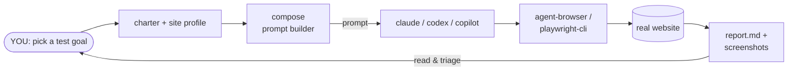
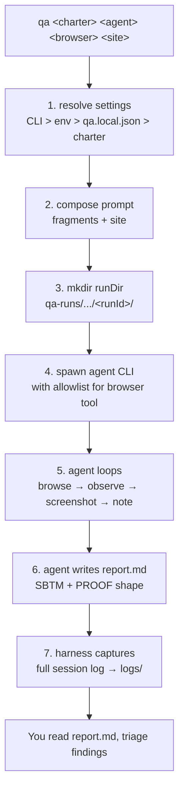

# explore-qa

An agent-driven exploratory testing harness you can point at any website.

`explore-qa` is a thin Bun runner that composes a prompt from Markdown fragments
and shells out to a headless coding agent (Claude Code, Codex CLI, or Copilot CLI).
The agent drives a browser CLI (`agent-browser` or `playwright-cli`) through a
charter — one mission, exploratory, mobile-first by default — and writes a
Markdown session report following SBTM + PROOF.

It is not a test runner and it is not a scripted suite. It is closer to giving
a QA engineer a mission statement and a browser.

## Mental model for QA engineers

If you've done session-based exploratory testing, this is the same loop —
just with an LLM agent in the tester seat:



You write the **charter** (the mission). The harness builds the **prompt**.
The agent runs the **session** in a real browser and hands you back a
**Markdown report** with findings, screenshots, and a session log you can audit.

## Quickstart

Prereqs: [Bun](https://bun.sh), at least one of `claude` / `codex` / `copilot`
on your PATH, and at least one browser CLI:

```bash
npm i -g agent-browser && agent-browser install
# or
npm i -g @playwright/cli && playwright-cli install --skills
```

Then:

```bash
git clone <this-repo> explore-qa
cd explore-qa
bun install
bun link   # expose `qa` globally (one-time per fork)

# 1. onboard a site (Claude Code required for this step)
#    Open this folder in Claude Code, then run:
#    /onboard-site https://example.com
#
#    This scaffolds sites/<name>.md and one or two starter charters.

# 2. run a charter
qa                  # interactive wizard
qa --list           # list charters / sites / agents / browsers
qa example-smoke claude agent-browser example   # direct
```

If you skip `bun link`, the same commands work as `bun scripts/qa.ts …`.

The harness ships with one placeholder site (`example`) and one smoke charter
(`example-smoke`) so `qa` works out of the box. Replace them with your own via
`/onboard-site`.

## How it works

What goes into one run:

```mermaid
flowchart LR
    subgraph INPUTS
        c[charters/&lt;charter&gt;.md<br/>the mission]
        s[sites/&lt;site&gt;.md<br/>baseUrl, journeys, quirks]
        p[prompts/_*.md<br/>system rules, honesty,<br/>browser workflow]
    end

    compose[compose.ts<br/>builds full prompt]
    sp[systemPrompt<br/>+ userPrompt]
    agent[agent CLI<br/>claude / codex / copilot]
    browser[browser CLI<br/>agent-browser / playwright-cli]

    subgraph OUTPUTS
        runs[qa-runs/charters/&lt;charter&gt;/<br/>_attachments/&lt;runId&gt;/<br/>├─ report.md<br/>├─ screenshots/<br/>└─ logs/ session.jsonl<br/>&#160;&#160;&#160;&#160;&#160;&#160;&#160;&#160;&#160;prompt-manifest.json]
    end

    c --> compose
    s --> compose
    p --> compose
    compose --> sp --> agent --> browser
    agent --> runs
```



Six moving parts:

1. **`sites/<name>.md`** — site profile. Frontmatter (`baseUrl`, `viewport`) +
   free-form Markdown body (critical journeys, consent banner, known quirks).
   Inlined into the system prompt for the active site.
2. **`charters/<name>.md`** — one charter = one test mission. Frontmatter
   (`runRoot`, `artifact`, `defaultModel`, `defaultBrowser`,
   `includeFragments`) + Markdown body with mission, areas, risks, scenarios.
3. **`prompts/_*.md`** — shared prompt fragments. `_system.md` and
   `_honesty-checks.md` are always inlined into the system prompt;
   `_browser-workflow.md` and `_report-format.md` are opt-in via
   `includeFragments`.
4. **`scripts/lib/compose.ts`** — loads the charter, parses frontmatter,
   substitutes `{{site}}` / `{{browser}}` / `{{runDir}}` / etc., concatenates
   fragments + site profile into `{ prompt, systemPrompt, meta }`. Also computes
   a `promptHash` and per-fragment `manifest` for regression tracking.
5. **`scripts/lib/agents.ts`** — switch over `claude` | `codex` | `copilot` that
   builds the right CLI invocation. Add new backends here only.
6. **`scripts/lib/browsers.ts`** — switch over `agent-browser` | `playwright-cli`
   that returns the tool name, the agent allowlist pattern, and any
   browser-specific env vars. Add new browser backends here only.

### Lifecycle of a charter run



Per run, artifacts land under `qa-runs/charters/<charter>/_attachments/<runId>/`:

- `report.md` / `result.md` — the agent-authored report
- `screenshots/` — named `<scenario>_<step>_<desc>.png`
- `logs/` — selective excerpts + full `<agent>-session.jsonl` +
  `prompt-manifest.json` (prompt fingerprint for regression tracking)

## Prompt versioning & regression tracking

Every run fingerprints the full composed prompt so you can tell whether a
difference in results comes from a prompt change, a site change, or agent
variance.

**What gets recorded:**

- **`promptHash`** (12-char sha256) — stored in the report frontmatter and the
  `qa-runs/README.md` index table. Same hash = identical prompt inputs.
- **`prompt-manifest.json`** — written to `logs/` alongside the session log.
  Lists each fragment that went into the prompt with its own 8-char hash:

  ```json
  {
    "promptHash": "134ed35118be",
    "fragments": [
      { "name": "charter:example-smoke", "hash": "a1458b34" },
      { "name": "frag:_browser-workflow", "hash": "a3deabf2" },
      { "name": "_system",               "hash": "ea6cedc8" },
      { "name": "_honesty-checks",       "hash": "8da638c7" },
      { "name": "site:example",          "hash": "d1248e95" }
    ]
  }
  ```

**Comparing two runs:**

```bash
bun scripts/compare-runs.ts \
  qa-runs/charters/smoke/2026-04-14_claude_agent-browser.md \
  qa-runs/charters/smoke/2026-04-17_claude_agent-browser.md
```

Output:

```
=== Prompt Changes ===
  promptHash: a3f8c2e91b04 -> b7d1e5f29c38
  Changed fragments: _honesty-checks

=== Results Delta ===
  Duration:  244s -> 310s  (+27%)
  Findings:  1 -> 3
  Status:    findings -> findings

=== Findings Diff ===
  Both runs:  F-01 Cart icon badge missing
  New in B:   F-02 Console 404 on /api/tracking; F-03 Viewport overflow

=== Verdict ===
  Prompt changed. Review changed fragments to assess impact.
```

**Dry-run preview:** `bun scripts/run-charter.ts <charter> --dry-run` prints
the prompt hash, manifest, full prompt, and CLI invocation without spawning an
agent.

## Skills

`explore-qa` ships a handful of skills under `.claude/skills/`, with a symlink at
`.agents/skills → ../.claude/skills` so all three agent CLIs pick them up:

- **Claude Code** reads `.claude/skills/` natively.
- **Copilot CLI** reads `.claude/skills/` natively (it also scans
  `.github/skills/` and `.agents/skills/`).
- **Codex CLI** only scans `.agents/skills/`, which is why the symlink exists.

- **`/onboard-site <url>`** — scaffold `sites/<name>.md` and two or three
  starter charters by browsing the target and asking a few questions. Run this
  once per new site.
- **`/new-charter`** — guided Q&A to add a new charter for the active site.
- **`/agent-battle <charter>`** — run one charter in parallel across all three
  agents (`claude`, `codex`, `copilot`) on `agent-browser`, stream live status
  ticks from each session log, and produce a comparison report (speed,
  findings, discipline, report quality). Useful for picking which agent to
  trust on a given site, or for spotting prompt regressions.

  ```
  > /agent-battle otto-cart-to-checkout.md
  • Charter: otto-cart-to-checkout, site: otto. Starting all three agents in parallel.
  • Bash(qa otto-cart-to-checkout claude  agent-browser otto)
  • Bash(qa otto-cart-to-checkout codex   agent-browser otto)
  • Bash(qa otto-cart-to-checkout copilot agent-browser otto)
  • All three agents launched. Scheduling first poll.
  • Three agents running on otto-cart-to-checkout. First status tick in ~60s.
  ```

## Settings precedence

Settings resolve in this order (highest wins):

CLI args > env vars > `qa.local.json` > charter frontmatter > hardcoded defaults.

- env: `SITE`, `AGENT`, `BROWSER`, `MODEL`, `RUN_ID`, `RUN_DIR`, `CHARTER`
- `qa.local.json` (gitignored): `{ "site", "agent", "browser", "model" }`
- charter frontmatter: `defaultModel`, `defaultBrowser`

Copy `qa.local.json.example` to `qa.local.json` and edit once per machine.

## Agent permissions

All three agent CLIs run in fully permissive mode — the harness is
non-interactive, so the agent cannot stop to ask a human for approval, and a
single unapproved shell call would stall the whole run. Concretely
(`scripts/lib/agents.ts`):

- **Claude Code** — `--permission-mode bypassPermissions`
- **Codex CLI** — `--dangerously-bypass-approvals-and-sandbox`
- **Copilot CLI** — `--allow-all-tools` (the CLI help explicitly calls this
  "required for non-interactive mode")

This is intentional: charter runs are sandboxed to a scratch run directory
under `qa-runs/`, and the agents are told via prompt which browser CLI to use.
Only run `explore-qa` against sites and on machines where you're comfortable
giving a coding agent full shell access for the duration of the run.

## Editing prompts

Invariants:

- Don't duplicate fragments. If a rule belongs in every run, it goes in
  `prompts/_system.md` or `prompts/_honesty-checks.md`, not in a charter body.
- Templates are `{{name}}` (Mustache-style). Add a key in `compose.ts` if you
  need a new one.
- `{{browser}} --help` first. The workflow fragment instructs the agent to read
  the live CLI help before the first step — this is what keeps the harness
  backend-agnostic. Don't put backend-specific subcommands back in the prompts.
- Screenshots only on findings and key states. Token/time budget.

## Credits & further reading

Every technique below is load-bearing in the harness — these links are worth
reading if you want to understand *why* runs are shaped the way they are,
rather than just what the code does.

### Charter framing — Elisabeth Hendrickson, *Explore It!*

A charter is a one-line mission shaped as "**explore** *target*, **with**
*resources*, **to discover** *information*." Hendrickson's *Explore It!*
(Pragmatic Bookshelf, 2013) is the canonical treatment — Chapter 2 ("Charter
Your Explorations") is where this shape comes from. Each file under
`charters/` is one such mission, and the system prompt hands the charter
body to the agent as its entire goal.

- Book: [pragprog.com/titles/ehxta/explore-it/](https://pragprog.com/titles/ehxta/explore-it/)

### Session-Based Test Management (SBTM) — James Bach & Jonathan Bach

SBTM trades scripted test cases for *chartered, time-boxed sessions* with a
structured debrief. The deliverable is a **session sheet**: what was tested,
what wasn't, what was found, and where the time went (design vs. bug
investigation vs. setup). That is exactly the shape of the `## Session` and
`## Task breakdown` sections in `prompts/_report-format.md` — this is why
`report.md` reads like a tester's notes instead of a wall of agent chatter.

- James Bach's original article (2000): [satisfice.com/download/session-based-test-management](https://www.satisfice.com/download/session-based-test-management)
- SBTM paper (PDF): [satisfice.us/articles/sbtm.pdf](https://www.satisfice.us/articles/sbtm.pdf)
- Overview: [Session-based testing on Wikipedia](https://en.wikipedia.org/wiki/Session-based_testing)

### PROOF debrief heuristic — Jonathan Bach

Jon Bach's five-point debrief shape, used by a test lead when reviewing a
session sheet with the tester:

- **Past** — what happened during the session
- **Results** — what was achieved
- **Obstacles** — what got in the way of good testing
- **Outlook** — what still needs to be tested
- **Feelings** — the tester's confidence in the result, and why

This maps one-to-one onto the `## PROOF debrief` section in
`prompts/_report-format.md`, so the agent's wrap-up has the same shape a
human tester would write.

### Exploratory testing in practice — Michael Bolton, *An Exploratory Tester's Notebook*

Bolton's PNSQC 2007 paper is the most concrete worked example of what a real
exploratory session looks like on paper — useful calibration for judging
whether a given `report.md` is actually good.

- Paper (PDF): [developsense.com/.../AnExploratoryTestersNotebook.pdf](https://www.developsense.com/presentations/2007-10-PNSQC-AnExploratoryTestersNotebook.pdf)
- Further resources: [developsense.com/resources](https://developsense.com/resources)
